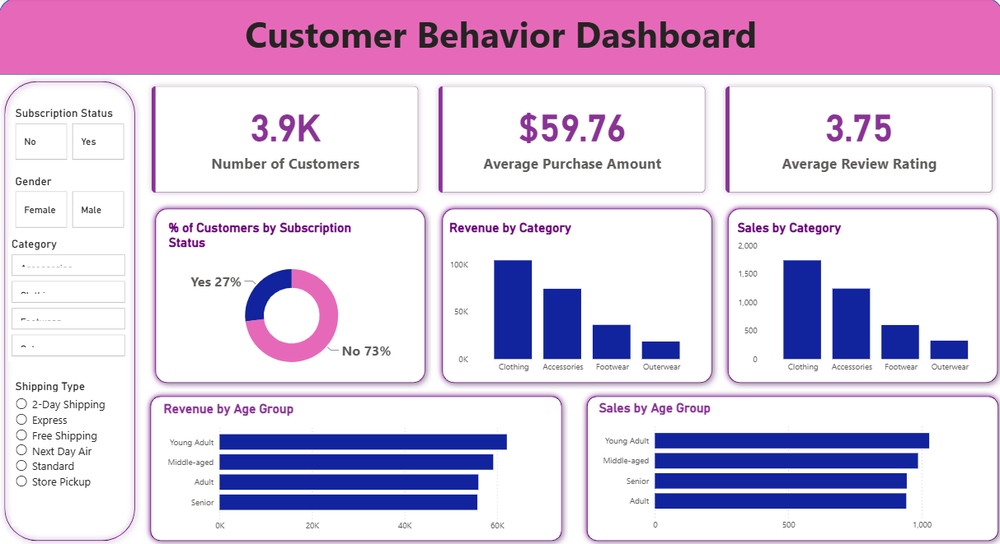

# Customer-Behavior-Analysis
Data Analytics Project showcasing Customer Behavior Analysis using SQL (POSTGRESQL), Python and Power BI

# Customer Shopping Behavior Analysis | Python | SQL | Power BI

An end-to-end **Customer Shopping Behavior Analysis project** using **Python, PostgreSQL, SQL, and Microsoft Power BI** to analyze customer purchases, product preferences, revenue, discounts, subscriptions, and customer segments.

This project was created as a **Data Analytics portfolio project** to strengthen skills in data cleaning, exploratory data analysis, SQL-based business analysis, feature engineering, data visualization, and dashboard development.

---

## 📊 Dashboard Preview

---

## 🎯 Project Objective

The objective of this project is to transform customer transaction data into meaningful business insights.

The analysis focuses on understanding:

- Customer purchasing behavior
- Revenue and sales patterns
- Product performance
- Discount usage
- Customer loyalty
- Subscription behavior
- Demographic trends

The project follows an end-to-end analytics workflow from **data preparation in Python → SQL analysis in PostgreSQL → visualization in Power BI**.

---

## 📌 Dataset

The dataset contains:

| Metric | Value |
|---|---:|
| Total Transactions | 3,900 |
| Total Columns | 18 |
| Missing Review Ratings | 37 |

The dataset includes customer demographics, purchase details, product information, discounts, subscriptions, shipping type, purchase frequency, and review ratings.

---

## 📈 Analysis Performed

The project includes analysis of:

* **Revenue by Gender**
* **High-Spending Discount Users**
* **Top Products by Customer Rating**
* **Shipping Type Comparison**
* **Subscribers vs. Non-Subscribers**
* **Discount-Dependent Products**
* **Customer Segmentation**
* **Top Products by Category**
* **Repeat Buyers & Subscription Behavior**
* **Revenue by Age Group**

---

## 🔍 Key Insights

Some observations from the analysis include:

* **3,900 transactions** were analyzed across multiple product categories.
* **3,116 customers** were classified as Loyal, compared with 701 Returning and 83 New customers.
* **Express shipping** had a higher average purchase amount than Standard shipping.
* **Gloves** had the highest average product rating at **3.86**.
* **Hat** had the highest percentage of discounted purchases at **50%**.
* **Young Adults** contributed the highest revenue among the age groups analyzed.
* The analysis identified opportunities around **subscriptions, customer loyalty, discount strategy, and product positioning**.

> These insights are based on the dataset used for this portfolio project.

---

## 🛠️ Tools & Technologies

* **Python**
* **Pandas**
* **PostgreSQL**
* **SQL**
* **Microsoft Power BI**
* Data Visualization

---

## 💡 Data Analytics Skills Demonstrated

* Data importing and exploration
* Data cleaning using Python
* Missing value treatment
* Feature engineering
* Data standardization
* PostgreSQL database integration
* SQL business analysis
* Customer segmentation
* Revenue analysis
* KPI development
* Interactive Power BI dashboard development
* Business-focused data storytelling

---

## 📂 Project Files

* `customer_shopping_behavior.csv` — Source dataset
* `customer_behavior_analysis.ipynb` — Python data cleaning and analysis
* `customer_behavior_analysis.sql` — SQL business analysis
* `Customer_Behavior_Dashboard.pbix` — Power BI dashboard
* `Customer_Behavior_Dashboard.png` — Dashboard preview

---

## 📚 Project Type

**Data Analytics Portfolio Project**

This project demonstrates an end-to-end approach to solving a business analytics problem using **Python, SQL, PostgreSQL, and Power BI**.

---

## 🚀 Future Improvements

Planned improvements for future versions include:

* Adding more advanced customer segmentation
* Developing additional Power BI measures using DAX
* Adding deeper subscription and retention analysis
* Exploring customer lifetime value
* Adding more advanced interactive dashboard features
* Incorporating predictive analytics

---

**Tools:** Python | Pandas | PostgreSQL | SQL | Power BI  
**Domain:** Retail / Customer Analytics / E-commerce
